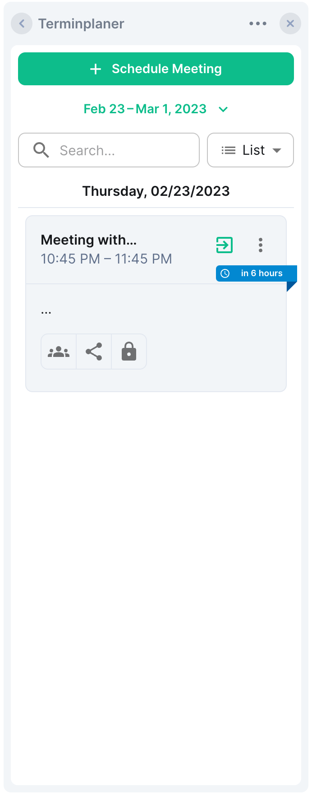
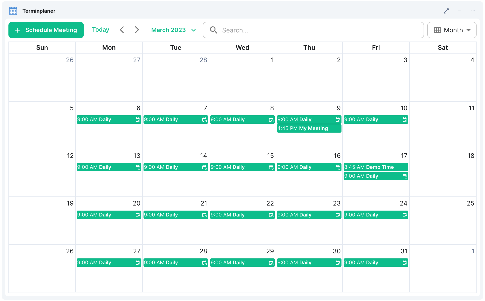
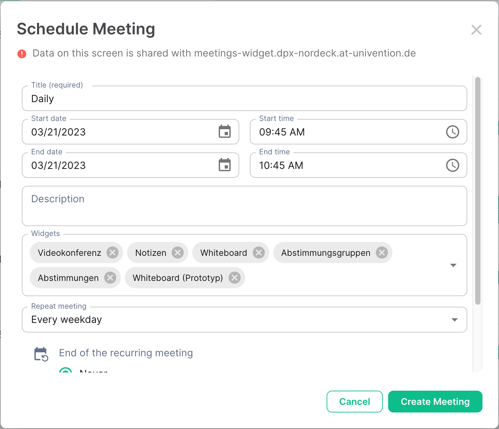
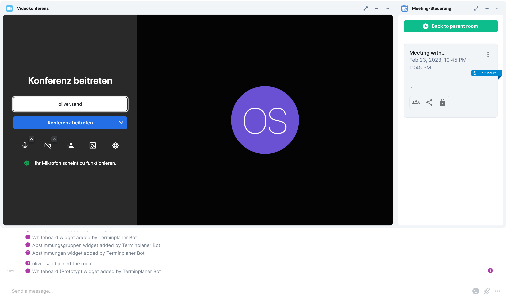
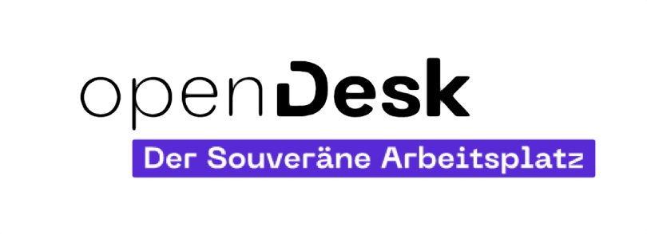

# NeoDateFix


[](https://matrix.to/#/#nordeck:matrix.org)

A solution to organizing meetings in [Matrix](https://matrix.org/) chat rooms and video conferences.
Users can plan meetings, configure options like widgets for meeting rooms, invite participants, perform breakout sessions, and see their calendar.
Meeting metadata is stored in Matrix rooms.
It also provides an API to create meetings from third party services, like Open-Xchange.

<table>
  <tr>
    <td>
      
    </td>
    <td>
      
    </td>
    <td>
      
    </td>
    <td>
      
    </td>
  </tr>
</table>

The widgets has multiple parts:

- [**NeoDateFix Widget**](./matrix-meetings-widget/): Matrix widget for managing and viewing the calendar.
- [**NeoDateFix Bot**](./matrix-meetings-bot): Matrix bot for creating meeting rooms.
- [**End-to-end tests**](./e2e): An end-to-end test suite for the Matrix widget and bot for creating meeting rooms.

## Getting Started

Development on the widget happens at [GitHub](https://github.com/nordeck/matrix-meetings).

### How to Contribute

Please take a look at our [Contribution Guidelines](https://github.com/nordeck/.github/blob/main/docs/CONTRIBUTING.md).

Check the following section on how to setup a development environment for the widget:

### Requirements

You need to install Node.js (`>= 20.0.0`, prefer using an LTS version) and run
`yarn` to work on this package.
The minimal Element version to use this widget is `1.11.29`.

### Installation

After checkout, run `yarn install` to download the required dependencies

> **Warning** Do not use `npm install` when working with this package.

### Configuration

Rename the provided `.env.local.default` to `.env.local` in the widget or bot folder and fill it with your configuration.
For a list of available options, see [Configuration](./docs/configuration.md).

### Running the Widget Locally

Follow the [instructions to run the widget locally](https://github.com/nordeck/matrix-widget-toolkit/tree/main/example-widget-mui#running-the-widget-locally).

Once running, you can visit the widget URL (`http(s)://localhost:3000/`) and follow the instructions on how to add it to a room within Element Web.

### Available Scripts

In the project directory, you can run:

- `yarn dev`: Start the widget for development.
- `yarn start`: Start the widget for development with a self-signed HTTPS certificate.
- `yarn build`: Run the build step in all projects.
- `yarn test`: Watch all files for changes and run tests of the widget.
- `yarn lint`: Run eslint in all projects.
- `yarn prettier:write`: Run prettier on all files to format them.
- `yarn depcheck`: Check for missing or unused dependencies.
- `yarn generate-disclaimer`: Generates license disclaimer and include it in the build output.
- `yarn deduplicate`: Deduplicate dependencies in the `yarn.lock` file.
- `yarn changeset`: Generate a changeset that provides a description of a
  change.
- `yarn docker:build`: Builds all containers from the output of `yarn build` and `yarn generate-disclaimer`.
- `yarn e2e`: Runs the end-to-end tests in a single browser. Pass `--debug` to enable the debug UI. Run `yarn docker:build` first.

### Running the bot locally

Follow the instructions in the [README.md](https://github.com/nordeck/matrix-meetings/tree/main/matrix-meetings-bot/README.md) file of the [matrix-meetings-bot](https://github.com/nordeck/matrix-meetings/tree/main/matrix-meetings-bot/) folder.

### Versioning

This package uses automated versioning.
Each change should be accompanied by a specification of the impact (`patch`, `minor`, or `major`) and a description of the change.
Use `yarn changeset` to generate a new changeset for a pull request.
Learn more in the [`.changeset` folder](./.changeset).

Once the change is merged to `main`, a “Version Packages” pull request will be created.
As soon as the project maintainers merged it, the package will be released and the container is published.

### Architecture Decision Records

We use [Architecture Decision Records (ADR)s](https://github.com/nordeck/matrix-widget-toolkit/blob/main/docs/adrs/adr001-use-adrs-to-document-decisions.md) to document decisions for our software.
You can find them at [`/docs/adrs`](./docs/adrs/).

## Deployment

You can run the widget using Docker:

```sh
docker run --rm -p 8080:8080 ghcr.io/nordeck/matrix-meetings-widget:latest
```

Be sure, that you also read the security notes in the base image [@matrix-widget-toolkit/widget-server](https://github.com/nordeck/matrix-widget-toolkit/tree/main/containers/widget-server) docs.

Our docker image supports customizing the nginx config by supplying additional config files.
For example, this allows running the image in an IPv4-only environment, as demonstrated at <https://github.com/nordeck/matrix-widget-toolkit/tree/main/containers/widget-server#custom-listen-directive>

You can run the bot using Docker:

```sh
docker run --rm -p 3000:3000 ghcr.io/nordeck/matrix-meetings-bot:latest
```

We also provide [HELM charts](./charts/).

Install via OCI Registry for the widget:

```sh
helm install matrix-meetings-widget oci://ghcr.io/nordeck/charts/matrix-meetings-widget
```

Install via OCI Registry for the bot:

```sh
helm install matrix-meetings-bot oci://ghcr.io/nordeck/charts/matrix-meetings-bot
```

## Supply Chain Security

To ensure transparency and security in our software supply chain, we provide comprehensive Software Bill of Materials (SBOM) reports for this project and signed container images.

### SBOM Reports

We provide SBOM reports within the widget container and as a release artifact.

- The generated SBOM report is available alongside the hosted widget assets, and can be found at `<DEPLOYMENT-URL>/sbom.spdx.json`, or via the filesystem at `/usr/share/nginx/html/sbom.spdx.json`
- For the bot container, you will find the SBOM at `/usr/local/share/doc/matrix-meetings-bot.sbom.spdx.json`
- Each GitHub release has a corresponding image SBOM scan report file attached as a release asset

### Signed Container Images

The container images releases are signed by [cosign](https://github.com/sigstore/cosign) using identity-based ("keyless") signing and transparency.
Execute the following command to verify the signature of the container images:

```sh
cosign verify \
--certificate-identity-regexp https://github.com/nordeck/matrix-meetings/.github/workflows/publish-release-bot.yml@refs/tags/@nordeck/matrix-meetings-bot \
--certificate-oidc-issuer https://token.actions.githubusercontent.com \
ghcr.io/nordeck/matrix-meetings-bot:<version> | jq
```

```sh
cosign verify \
--certificate-identity-regexp https://github.com/nordeck/matrix-meetings/.github/workflows/publish-release-widget.yml@refs/tags/@nordeck/matrix-meetings-widget \
--certificate-oidc-issuer https://token.actions.githubusercontent.com \
ghcr.io/nordeck/matrix-meetings-widget:<version> | jq
```

Execute the following command to verify the signature of a chart container image for the bot (example for version: `@nordeck/helm-matrix-meetings-bot-0.1.1`):

```sh
cosign verify \
--certificate-identity-regexp https://github.com/nordeck/matrix-meetings-bot/.github/workflows/helm-release.yml@refs/tags/@nordeck/helm-matrix-meetings-bot-0.1.1 \
--certificate-oidc-issuer https://token.actions.githubusercontent.com \
ghcr.io/nordeck/charts/matrix-meetings-bot:0.1.1 | jq
```

Execute the following command to verify the signature of a chart container image for the widget (example for version: `@nordeck/helm-matrix-meetings-widget-0.2.0`):

```sh
cosign verify \
--certificate-identity-regexp https://github.com/nordeck/matrix-meetings-bot/.github/workflows/helm-release.yml@refs/tags/@nordeck/helm-matrix-meetings-widget-0.2.0 \
--certificate-oidc-issuer https://token.actions.githubusercontent.com \
ghcr.io/nordeck/charts/matrix-meetings-widget:0.2.0 | jq
```

## Matrix Room Upgrades

It may be necessary to upgrade meeting rooms to a different Matrix room version, for example to use room version 12.
You can learn more about Matrix room upgrades in general [on the Matrix.org website](https://matrix.org/docs/communities/administration/#room-upgrades).

Rooms used with NeoDateFix have special attributes.
These rooms cannot simply be upgraded, as this will not keep the widget-specific events and
will make the state stored in the meetings inconsistent.

**The recommended way to "upgrade" instead is to recreate the rooms that were created or modified by the bot.**
All the necessary content must be exported from these rooms.

This applies to all the rooms: one-to-one chat with the bot, calendar room with meetings widget,
meetings rooms, and breakout session rooms.

- In the case of one-to-one chat: the user has to leave the room and interact with the bot anew using a direct message.
- In the case of calendar room: the user has to leave the room, create a new one and invite the bot to the new room.
- In the case of meeting rooms and breakout rooms: the meeting creator should export any widget contents in the old meeting room and then has to delete their meetings via the meetings widget UI and create new meetings.

A new room gets the default room version from the Matrix server. This applies to the bot: new meeting rooms
will use the default room version.

The widget and the bot are supported to work with multiple different room versions. It is not
required to have the same room version for all bot rooms.

Room version 12 is supported from [widget version 1.7.2](https://github.com/nordeck/matrix-meetings/releases/tag/%40nordeck%2Fmatrix-meetings-widget%401.7.2) and [bot version 2.8.4](https://github.com/nordeck/matrix-meetings/releases/tag/%40nordeck%2Fmatrix-meetings-bot%402.8.4).

## License

This project is licensed under [Apache 2.0 license](./LICENSE).

The disclaimer for other OSS components can be accessed via the `/NOTICE.txt` endpoint.
The list of dependencies and their licenses are also available in a machine readable format at `/usr/share/nginx/html/licenses.json` in the container image.

## Sponsors

<p align="center">
   <a href="https://www.dphoenixsuite.de/"></a>
   &nbsp;&nbsp;&nbsp;&nbsp;
   <a href="https://www.dataport.de/"></a>
   &nbsp;&nbsp;&nbsp;&nbsp;
   <a href="https://gitlab.opencode.de/bmi/opendesk/info"></a>
   &nbsp;&nbsp;&nbsp;&nbsp;
   <a href="https://www.nordeck.net/"></a>
</p>

This project is part of the [dPhoenixSuite by Dataport](https://www.dphoenixsuite.de/) and the [openDesk Sovereign Workplace](https://gitlab.opencode.de/bmi/opendesk/info) by [BMI](https://www.bmi.bund.de/DE/startseite/startseite-node.html)/[ZenDiS](https://zendis.de).
