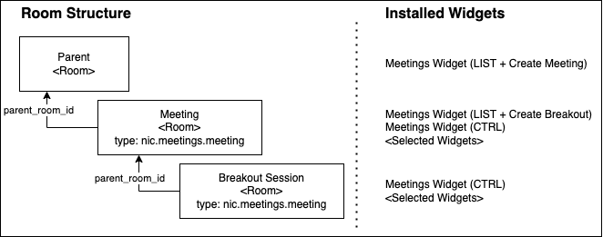
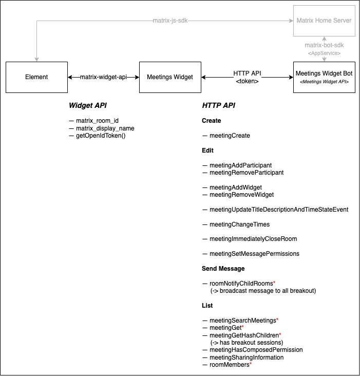
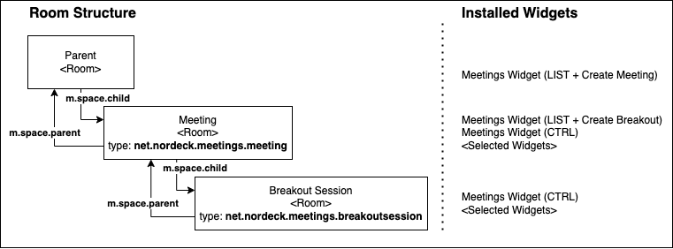
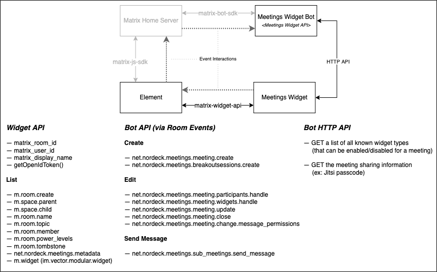

# ADR001: Use the Widget API to interact with the Meetings Bot to Create, Manage, and Display Meetings

Status: draft

> This document uses ⚠ to highlight features which are not yet implemented.

<!-- These documents have names that are short noun phrases. For example, "ADR001: Deployment on Ruby on Rails 3.0.10" or "ADR009: LDAP for Multitenant Integration" -->

## Context

<!--
This section describes the forces at play, including technological, political, social, and project local. These forces are probably in tension, and should be called out as such. The language in this section is value-neutral. It is simply describing facts. -->

The meetings widget can schedule and manage meetings.
The widget is initially installed in a management room.
This can be any type of room, a common example is a team room where meetings are created between room members.
The widget creates individual Matrix rooms for (1) each meeting and (2) each breakout session of each meeting.
The management room has a parent relation to all created meetings.
Each individual meeting has a parent relation to all related breakout sessions.
Each room is configured with a variant of the meetings widgets and a selection of other widgets (ex: Poll, Whiteboard, Jitsi, …).

This is the current room architecture:



Rooms are created and setup by an _app service_ that is connected to a Matrix Home Server.
It provides a REST API that is called from the meetings widget.
Each request is acompanied by an OpenID token that is provided by the widget API.
The app service uses the token to impersonate the user and to execute the actions.

This is the current architecture including a list of the API features:



Due to the advances in the `matrix-bot-sdk` and the `matrix-widget-api`, some of these actions became available in the bot SDK and in the widget SDK (features without bot interaction are marked with a `*`).
It was decided to create a new bot with a new interface (and also some breaking changes).
The bot will react on Matrix Room Events and will only fallback to a REST API if their is no other option.
Thus, the frontend needs to implement the new Matrix-API-based API.

> There are more features that could be moved into the `matrix-widget-api` in the future that will be discussed in a follow-up ADR.
>
> This includes:
>
> - Invite and remove participants.
> - Update the title or description of a meeting
> - Change the power level configuration
> - Move a meeting.
>
> The following is _not_ (yet) possible:
>
> - Create a room.
> - Close a room.
>
> Some actions have limitations:
>
> - Modify meeting details:
>   A user can only see rooms where he is at least invited, but in order to edit the title, a user must have joined.
> - Send a message to all breakout rooms:
>   We can only send messages to rooms that a user joined.
>   Since this action is in the context of the parent room, the user might _not_ have joined every breakout session yet.
>   There could be a message to advise the user to join every room.
> - Setup Widgets:
>   Only the bot knows all the widgets and their respective configuration.

## Decision

<!-- This section describes our response to these forces. It is stated in full sentences, with active voice. "We will ..." -->

- We will call the new `matrix-meeting-widget-bot` via Matrix Events.
- We will use the widget API to request all information that are no longer provided by the bot.
  We will migrate the code-base to use `matrix-widget-toolkit`.
- We will design new Redux slices and replace all previously available API bindings.
- We will take the opportunity to refactor the React elements in this process if needed.
- We will increase the test coverage.

## Consequences

<!-- This section describes the resulting context, after applying the decision. All consequences should be listed here, not just the "positive" ones. A particular decision may have positive, negative, and neutral consequences, but all of them affect the team and project in the future. -->

The new bot implementation uses a different room structure.
It makes use of existing matrix features (i.e. state events like `m.room.name`) where possible and only creates custom types where no standard exists.
For example, it uses the events of the [spaces feature](https://github.com/matrix-org/matrix-doc/blob/main/proposals/1772-groups-as-rooms.md#relationship-between-rooms-and-spaces) to create relations between the different rooms.

This is the new room architecture. Key changes are **bold**:



Rooms are created and setup by the bot.
The bot is a member of all discussed room types.
It is controlled by Matrix Room Events that are sent by the meetings widget via the widget API.
It also provides a set of REST APIs to provide additional information.
This api is called with the OpenID token from the widget API to [verify the identity of the calling entity](https://spec.matrix.org/v1.1/server-server-api/#openid).

This is the new architecture including a list of the used API features:



### Basics

These are some basic principles for the widget interaction with the bot.

General assumptions:

- The widget should generate a list of the rooms based on the meetings.
- The widget can only access information from rooms that are accessible to the Matric Client (i.e. Element). Thus, he must be at at least invited to any room that should be displayed.

#### Room Initialization

The user has two options to start using the meetings widget:

1. Welcome Room:
   1. The user invites the bot user into a room that should organize meetings.
   2. The bot invites the user into a “Welcome Room”.
   3. The welcome room instructs the user to upgrade the bot to be an `administrator`.
   4. Once `administrator`, the bot adds the meetings widget to the room.
2. Integration Manager (or `/addwidget …`):
   1. The user installs the meetings widget.
   2. ⚠ The meetings widget warns that the bot is not invited.
   3. The user adds the bot.
   4. ⚠ The meetings widget warns that the bot is not an `administrator`.
   5. The user upgrades the bot to be an `administrator`.

#### Endpoint Configuration

The widget needs to call the REST API of the bot.
Therefore, it needs to know the endpoint of the bot.

The endpoint is configured in the deployment of the widget.
This means, that a widget deployment can only work with a single bot deployment.
In addition, the widget configuration includes the username of the bot account.

> In future, the bot might want to be discoverable via e.g. a state event.

> In an edge case, multiple bot members could be in the same room.
> In order to not handle events twice, each room event _could_ specify a “target user” that should handle it.
> This is not planned, yet.

#### Event Acknowledgements

The user wants to know if an action was executed.
Since the events are of asynchronous nature, there will be synchronous feedback.
In theory, the matrix protocol provides the ephemeral `m.receipt` event (with `m.read` type) to tell if the bot read an event.
However, these events are not yet accessible to the widget api and they won't tell if the execution succeeded.

As an alternative, there is the `m.reaction` event that is based on [MSC2674](https://github.com/matrix-org/matrix-doc/blob/main/proposals/2674-event-relationships.md) and [MSC2677](https://github.com/matrix-org/matrix-doc/pull/2677).
It is used to add emoji reactions (ex: ✅ or ❌) to messages.
[MSC2677](https://github.com/matrix-org/matrix-doc/pull/2677) also proposes that “[a]nother usage of an annotation is e.g. for bots, who could use annotations to report the success/failure or progress of a command.”

The bot sends `m.reaction` events to the room once a room event was consumed.
The bot will include the status of the execution as `key` in form of an emoji:

- ✅: The request was successfully executed.
  ⚠ If the event did create a new room, the room id will be included in the optional `content."net.nordeck.meetings.bot.meta".created_room_id` field.
- ❌: An error occurred.
  The user might get more details in another room (see [Error Handling](#error-handling)).
  The room will be included in the optional `content."net.nordeck.meetings.bot.meta".room_id` field.

```json
{
  "type": "m.reaction",
  "content": {
    "m.relates_to": {
      "rel_type": "m.annotation",
      "event_id": "$some_event_id",
      "key": "✅"
    },
    // optional
    "net.nordeck.meetings.bot.meta": {
      // optional, if error
      "room_id": "!a-private-room-that-holds-the-error",
      // optional, if the event created a new room (i.e. create meeting room)
      "created_room_id": "!the-created-room"
    }
  }
}
```

⚠ The meeting widget should add a reasonable timeout and notify the user that an action will/might be processed in the future.

If the bot doesn't have the permissions to write into the room, it should ignore the error.
⚠ The meetings widget shows a warning if the `power_levels` are not configured correctly.

##### Error Handling

Due to privacy concerns, the bot will report errors in a private 1:1 chat room to the sending user.
The meetings widget will not be able to receive this message.
⚠ If the `m.reaction` event includes the room id of this private room, the widget should show a “show details” button in the error message.

##### Health Checks

If the bot is not available, the user should be notified.
It might be a nice UX addition to show a message to reduce frustrations (ex disable the “create meeting” button).
The `m.presence` is no room event and thus not (yet) available to the widget.
But the widget can use the `/v1/health` endpoint to tell whether the bot is online.

> ⚠ This is optional and has a low priority.

### Actions

The bot will only be used to create and mutate meetings.
The widget can read state events from the client to compose the list of active meetings and the meeting details.

> This section highlights only selected actions.
> The authoritative source for the room event schema is the [data model](../data-model.md).

#### Permissions

The widget needs to read the following events from _all_ rooms a user has joined:

- `m.room.create`: `content.type` identities if the room is a meeting or a breakout session.
- `m.space.parent`: the parent room that created this meeting (ex: `management <- meeting` | `meeting <- breakout`).
- `m.space.chlid`: the child rooms of this room (ex: `management -> meeting` | `meeting -> breakout`).
- `m.room.name`: the name of the meeting.
- `m.room.topic`: the description of the meeting.
- `m.room.member`: the participants in a meeting.
- `m.room.tombstone`: if present, the meeting was canceled/deleted.
- `m.room.power_levels`: tells if users are allowed to post messages in the meeting channel.
- `net.nordeck.meetings.metadata`: the `start_time` and `end_time` of the meeting.
- `m.widget` (`im.vector.modular.widget`): the installed widgets (`state_key === widget-id`).

> At date (2022-01-19), the matrix widget API can only use the same permissions in _all_ rooms.
> We are not able to only request to send room events into a single room (see [MSC2762](https://github.com/matrix-org/matrix-doc/pull/2762)).

#### List all meetings

Get a list of all rooms that are children of the management room:

<!--prettier-ignore-->
```js
m.room.create  [content.type] === 'net.nordeck.meetings.meeting'
m.space.parent [state_key]    === $room_id
∃ $userId ∈ m.room.member [content.membership ∈ (join, invite)]
∃ m.room.name
∃ net.nordeck.meetings.metadata
∄ m.room.tombstone
```

#### List all Breakout Sessions

Get a list of all rooms that are children of the meeting room:

<!--prettier-ignore-->
```js
m.room.create  [content.type] === 'net.nordeck.meetings.breakoutsession'
m.space.parent [state_key]    === $room_id
∃ $userId ∈ m.room.member [content.membership ∈ (join, invite)]
∃ m.room.name
∃ net.nordeck.meetings.metadata
∄ m.room.tombstone
```

#### Room Invitations

The bot can't force-join users into a room.
Thus, both users create a meeting or are added to a meeting, are invited into the room.
However, invited rooms only provide a subset of events (see [Stripped State](https://spec.matrix.org/unstable/client-server-api/#stripped-state)).
We won't be able to show the full information about the meetings until the user joined the rooms.

We will collect all information we can get and will show them in a “notification” style.
Under the assumption that the bot has the power to create `m.space.child` events in the parent room, we use these events to filter these invitations to show only the relevant ones.
Since we can't read the start and end time from the invited rooms, we will only show the available details.
We also add a “View Details” button that links to the room.
We also display the “invite reason”.

Get a list of all rooms that represent meeting invitations:

<!--prettier-ignore-->
```js
m.room.create [content.type] === 'net.nordeck.meetings.*'
m.space.child [state_key]    === $room_id
∃ $userId ∈ m.room.member [content.membership === 'invite']
∃ m.room.name
∄ net.nordeck.meetings.metadata
```

#### Activate / Deactivate Widgets

The list of activated widgets is derived from the `im.vector.modular.widgets` (`m.widgets` in future (see [MSC2764](https://github.com/matrix-org/matrix-doc/pull/2764))) state events.
Widgets are activated and deactivated by the `net.nordeck.meetings.meeting.widgets.handle` room event.
The bot provides a `/v1/widget/list` endpoint with a list of known widgets (`{ id: string; name: string }`).
The `id` corresponds to the `state_key` of the `im.vector.modular.widgets` event.
By default, the widget will enable all widgets in the creation forms.

> Widget titles are not localized but are displayed as-is.
> They are defined by the bot.

We won't show any icons for the widgets.
In future, the bot might include the icons as MXC url that the widget could display.
However, this is not planned yet.

#### Invite / Remove Participants

The list of meeting participants is derived from the `m.room.member` event.
Only users with a `join` or `invite` membership should be considered.
A user that left the room or declined an invite, will _not_ be displayed.

We provide the list of all members of the current room as potential invitees for meetings or breakout sessions.
This will change in the future once we can access the user directory (see [`element-web#20071](https://github.com/vector-im/element-web/issues/20071)).

The bot user is part of every room.
The widget show not show the bot user as a participant, nor provided as invitee.

#### Show the Jitsi Information (Sharing)

Users can share the meeting information per mail and per ICS file.
These include:

- a link to the meeting room based on the `clientOrigin`.
- If `jitsiDialInEnabled` is enabled in `/v1/config`, get dial in number and pin from `/v1/meeting/:roomId/sharingInformation`.

> We will use the [`ics` library](https://www.npmjs.com/package/ics).

> In future, we should investigate if we want to use matrix.to links instead of forcing the receivers to a specific Element instalation.

#### Show the Room Permissions

The meetings widget can configure if normal users are permitted to send messages into a room.
The state of this config is derived from the `events_default` content in the `m.room.power_levels` event.
The power level is changed by the `net.nordeck.meetings.meeting.change.message_permissions` room event.

> The `m.room.power_levels` event could also be updated by the admin.
> This is not yet planned.

The power level is specified as a number.
We will use `0` to tell that all users can send messages.
We will use `100` to tell that only admins can send messages.
The max value is configurable by an environment variable (`REACT_APP_MESSAGING_NOT_ALLOWED_POWER_LEVEL`).

#### Additional Information

**Redux Slice design**:
The new slice will be setup according to [ADR0002](./adr002-use-redux-toolkit-query.md).

**`force_deletion_time`**:
This flag is part of the `net.nordeck.meetings.metadata`.
It tells when the room will be closed/deleted.

**“BreakOut” and “MeetingControl” widget in breakout sessions**:
This split is no technical requirement.
It was done to be able to set a flexible layout in the future, where the breakout widget is in the sidebar and the control in fullscreen mode.

**Disable “Invite Participant”**:
We keep the optional `REACT_APP_HIDE_USER_INVITE` config option.
It disables the invite list in the meeting creation and mutation.
This can be deleted once a widget can [access a user directory](https://github.com/vector-im/element-web/issues/20071).

**Tombstone**:
When a room is deleted, the bot adds a `m.room.tombstone` event.
Rooms that contain this event should be ignored.

### Redux Slice Design

We want to have actions to:

- …create a meeting.
- …create breakout sessions for a meeting.
- …update a meeting.
- …cancel/close a meeting.
- …change the user permissions of a meeting.
- …invite participants to a meeting.
- …remove participants from a meeting.
- …add widgets to a meeting.
- …remove widgets to a meeting.

We want to have selectors to:

- …know if we are in a management room, in a meeting room, or in a breakout room.
- …get the active meeting in this room (including widgets, participants, etc.).
- …get a list of all meetings in this room.
- …check if a meeting has active breakout sessions.
- …get a list of all meetings that a user is invited to.

<!-- This template is taken from a blog post by Michael Nygard http://thinkrelevance.com/blog/2011/11/15/documenting-architecture-decisions -->
